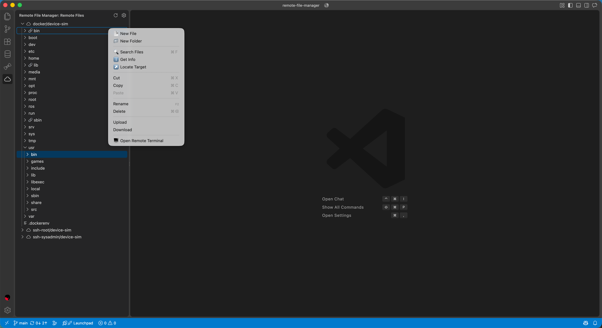
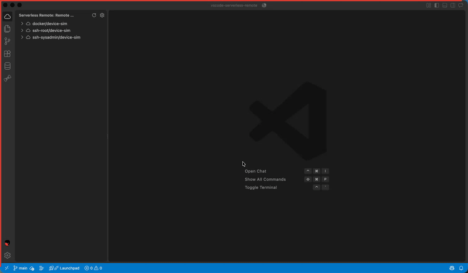

# Remote File Manager

A lightweight VS Code extension that lets you browse and edit files from Docker containers, SSH hosts, or local WSL2 distributions without installing a remote VS Code server.

[vscode marketplace](https://marketplace.visualstudio.com/items?itemName=xiaoming110.remote-file-manager)

latest screenshot:



screen recording:



## Features

- Remote directory tree in a custom sidebar
- File browsing through a custom `remote-file-manager://` virtual filesystem
- Interactive remote terminals for Docker containers, SSH hosts, and WSL2 distributions
- Docker, SSH, and WSL2 connectors behind a shared abstraction layer
- Optional diagnostic guard to reduce noise from virtual-file type checking

## Setup

1. Open Settings and configure `remoteFileManager.connections`.
2. Use the "Add Sample Docker Connection" command or create a connection with a Docker container name, SSH target, or WSL2 distribution.
3. Select files from the custom tree view to open them in the editor.
4. Right-click a connection or directory and choose "Open Remote Terminal" to start a native VS Code terminal in that remote directory.

Multiline paste is inserted as one space-separated command line and is not submitted automatically. Press Enter after reviewing the pasted content.

## Release

Create a tag whose version matches the release, for example `v0.1.2`. GitHub Actions will package that version, publish the VSIX to the Visual Studio Marketplace, and attach it to a GitHub Release.

Before creating the tag, add a Visual Studio Marketplace Personal Access Token as the repository secret `VSCE_PAT`.

See [CHANGELOG.md](./CHANGELOG.md) for the release history.

## Example settings

```json
{
  "remoteFileManager.connections": {
    "connections": {
      "docker": [
        {
          "id": "docker/my-app",
          "container": "my-app",
          "path": "/workspace"
        }
      ],
      "ssh": [
        {
          "id": "ssh/example.com",
          "host": "example.com",
          "username": "ubuntu",
          "path": "/home/ubuntu/project"
        }
      ],
      "wsl": [
        {
          "id": "wsl/ubuntu-22.04",
          "distribution": "Ubuntu-22.04",
          "path": "/home/user/project"
        }
      ]
    }
  }
}
```
